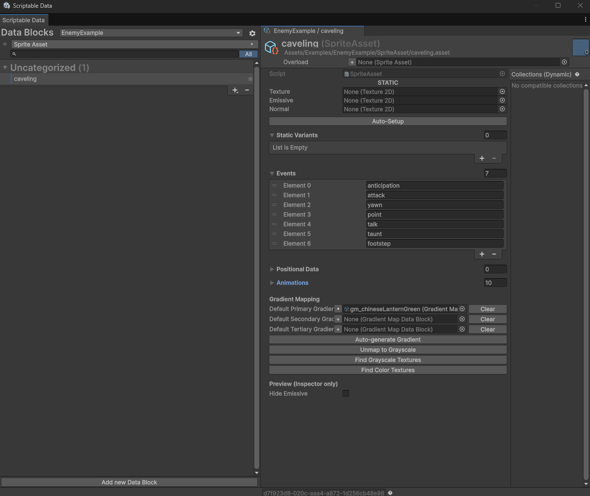

# Enemy Example

In the case of an Enemy we will want to create a Sprite Asset Data Block which we'll assign to the Enemy prefabs' Sprite Object. We start by creating a Sprite Asset in our mods' scriptable data directory. You can do so by opening up the Scriptable Data Editor Window, making sure the right Data Block directory is selected and selecting the Sprite Asset sorting type, then press Add new Data Block and proceed to set it up.&#x20;

<figure><figcaption></figcaption></figure>

The animations are set up by adding an animation entry and referencing a texture, then selecting the amount of frames you'd like for the animation to have based on how many you intended when you created the texture.&#x20;

<figure><figcaption></figcaption></figure>

Once you've set up your Sprite Asset Data Block with the wanted animations, you can proceed to set up your Enemies' prefabs. There will always be two prefabs that you'll have to create, one prefab which will be the actual entity containing game logic, on our end we call this the ECS prefab, and another prefab containing the Sprite Object which'll hold the enemies' graphics.&#x20;

<figure><figcaption></figcaption></figure>

The main components required for your enemy to work are:

* Object Authoring, which gives the enemy its' Object Type, Graphical Prefab reference, and Object ID (Object Name will be converted to Object ID).&#x20;
* Linked Entity Groiup Authoring
* Ghost Authoring Component, which allows for the entity to be networked.

There are many more components for the ECS Prefab referenced in the Enemy Example which can be found in the Examples zip once you've set up the ModSDK in Unity and opened the project.

Once you've set up your ECS Prefab you can proceed with setting up the Graphical Prefab, for which you'll need to set up a script, feel free to re-use the existing script used for Enemy Example and build up from there using the API.&#x20;

```csharp
using Unity.Core;
using Unity.Entities;
using Unity.Transforms;
using UnityEngine;

public class Enemy1 : EntityMonoBehaviour
{
    public GameObject graphics;
    
    protected override void DeathEffect()
    {
        graphics.SetActive(false);
        base.DeathEffect();
    }

    // Any IGraphicalObject component will get called by UpdateGraphicalObjectSystem
    public override void GraphicalUpdate(Entity entity, EntityManager entityManager, TimeData timeData)
    {
	    base.GraphicalUpdate(entity, entityManager, timeData);

		// Need to handle EntityMonoBehaviour update manually, hopefully more automatic in future
	    UpdatePosition(true, EntityUtility.GetComponentData<LocalToWorld>(entity, world));
	    UpdateDestroyedState(EntityUtility.GetComponentData<HealthCD>(entity, world).health <= 0);

	    if (conditionEffectsHandler != null)
	    {
		    conditionEffectsHandler.UpdateShowing(false);
	    }
    }
}
```

<figure><figcaption></figcaption></figure>

The primary function of this prefab is to set up the Sprite Object, which will hold out Sprite Asset Data Block that we created earlier.

<figure><figcaption></figcaption></figure>

