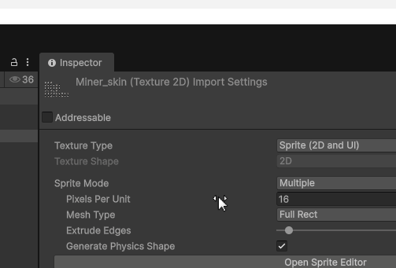

# Addressables

The game uses [**Addressables**](https://docs.unity3d.com/Packages/com.unity.addressables@2.7/manual/index.html) for certain assets and [**AssetReference**](https://docs.unity3d.com/Packages/com.unity.addressables@2.7/api/UnityEngine.AddressableAssets.AssetReference.html) fields to minimize memory usage. An `AssetReference` is a weak reference to a Unity asset that is resolved via the Addressables system.

To assign an asset from the Mod SDK to an `AssetReference` field, you must first make that asset an Addressable by checking the Addressables checkbox in the Inspector.

This is a requirement of the `AssetReference` field. Without checking this box, the asset picker will not allow you to select the asset.

<figure><figcaption></figcaption></figure>

#### Addressables in the Mod SDK

Addressables is a pretty complex system and this might give you all kinds of question when working in the Mod SDK regarding what address you should choose, if you need to select some specific label or tweak other settings.

The easy answer here is that none of it matters! The reason being that mods don't use Addressables at all. The mod loader logic will add any assets to Addressables in such a way that `AssetReference` will still work. Fetching mod assets via labels will not work. If we need to get all assets of a certain type or group we will be using ScriptableData and data blocks instead of Addressables labels.
