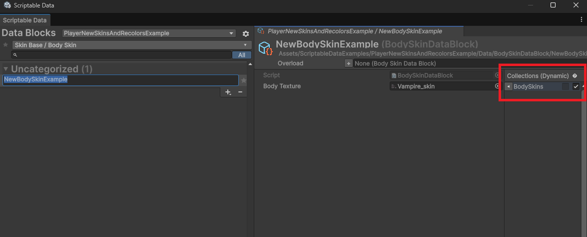
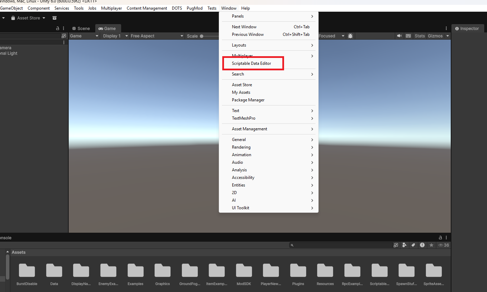

# How to work with Scriptable Data

### Features

* A persistent data editor with tabs, categorization, search bar, favorites, selection history, custom utility functions, and more!
* A friction-free experience for adding new data types: all you need to do is inherit from `ScriptableDataBlock` and your new type shows up in the editor automatically, ready to start using!
* Automatic management of asset files through drag-and-drop in the editor and collapsable headers.
* Runtime lists of loaded data blocks, with built-in network ID.
* Inherent mod support through soft references and address overloading.
* Export/importable editor state for workspace configuration or transfer.

### Scriptable Data Block

A data block represents a _piece of data_, or an _instance of a data type_. You might for example have an `EnemyDataBlock` type, and several data blocks of that type, like forestGoblin, desertGoblin, forestBird etc.

Data block types must inherit from `ScriptableDataBlock`, which itself inherits from `ScriptableObject`.&#x20;

Everything that works with ScriptableObjects also works with data block types, with one exception: you should not use direct references to data blocks. Instead, use `DataBlockRef<T>` where `T` is your data block type. A data block ref uses an address (`Guid`) to "softly" refer to a data block. At runtime, the address is used to "get" the data block from the runtime lookup. This is why the system supports modding inherently: as long as a data block with the same address as another is loaded after it, _it will override it_. This allows modders to "replace" our data blocks with their own.

### DataBlockAddress

<figure><figcaption></figcaption></figure>

A `DataBlockAddress` is a wrapper around `System.Guid` and is used to identify and refer to a data block. In the editor, the address is automatically synced to the asset `GUID` .

### DataBlockRef

A `DataBlockRef` is a wrapper struct around a `DataBlockAddress` and is used to "fetch" the actual data block using its `Get()` function. To check if a `DataBlockRef` is pointing to a data block or not, use the `hasAddress` property.

#### Declaring a DataBlockRef

`public DataBlockRef<EnemyDataBlock> enemyDataRef;`

#### Using the DataBlockRef

```
if (enemyDataRef.TryGet(out EnemyDataBlock enemyData))
{
    // Do something with enemyData...
}
```

or simply (if you know the field must be valid):

```
EnemyDataBlock enemyData = enemyDataRef.Get();
// Do something with enemyData...
```

A `DataBlockAddress` is also implicitly convertable to a `DataBlockRef`, which can be used to assign a data block to a ref from code using the data block's `address` field:

```
enemyDataRef = someEnemyDataBlock.address;
```

### DataBlockCollection

A `DataBlockCollection` is a data block type that wraps around a collection of `DataBlockRefs`, but crucially, it uses a _two-way reference system_, which allows data blocks _themselves_ to reference the collection as a way to be included, _without actually modifying it_.&#x20;

A data block that is included on the collection itself is referred to as a static reference, whereas a data block that is included by pointing to the collection is referred to as a dynamic reference.&#x20;

<figure><figcaption></figcaption></figure>

This for example is how Static entries will look like in the Scriptable Data Editor.

<figure><figcaption></figcaption></figure>

Whereas Dynamic entries will need to be added by going to the Data Block that you'd like to add to the collection and then checking the checkmark under Collections.

<figure><figcaption></figcaption></figure>

At runtime, static and dynamic references are merged into a single list, which is what is used when accessing the collection.

Scriptable Data Blocks should only add to the collections that they belong in, for example a HairSkinDataBlock shouldn't be added to the BodySkinsCollection.&#x20;

### Scriptable Data Editor Window

You can discover the Scriptable Data Editor by going to `Window` > `Scriptable Data Editor` .

<figure><figcaption></figcaption></figure>

### Scriptable Data Directories

Scriptable data directories point to where your Scriptable Data Blocks will be located when they're created with that directory selected, which will be in a sub-directory of where the scriptable data directory itself is stored.&#x20;

As an example if I have the BurstDisable Scriptable Data Directory selected and choose to add a new data block then it'll be created in a sub-folder of where that directory is located.&#x20;

<figure><figcaption></figcaption></figure>

A Scriptable Data Directory will be automatically created for you whenever you create a new mod via the ModSDKWindow, however for mods that were made before this update you'll have to create it manually via the Create menu, you can do so by right clicking in the folder you want to create it in and selecting `Create` > `Scriptable Data` > `Additional Data Directory` .

<figure><figcaption></figcaption></figure>

### Overloading Scriptable Data Blocks

To overload a data block, you must first import game assets via the ModSDKWindow, once you've done that you should open the Scriptable Data Editor Window and select the Core Keeper Assets (readonly) directory.

<figure><figcaption></figcaption></figure>

Then, find the Data Block you'd like to overload. Once you've found the DataBlock that you'd like to overload, right click it and select `Overload` > `YourModsDirectory` .&#x20;

<figure><figcaption></figcaption></figure>

This will create a copy of the same Data Block in a sub-folder of where that Scriptable Data Directory asset is created, but generate a different address. The copy overrides the original Data Block that it is overloading by targeting its' address.

You can now sort by your Scriptable Data Directory to find the newly made Data Block.


We're working on making imported game assets have the same GUID every time they're imported, for the time being please beware that if you import the assets again it will lead to missing reference issues.


### Scriptable Data Block types which support Modding

#### Ground Fog

Can be used to generate fog around certain block types.

#### Gradient Map

Recolors existing Sprite Assets and Sprite Asset Skins by reference.

#### Sprite Asset

Stores a texture which can also be animated if it contains multiple frames. Can be recolored by referencing a Gradient Map.

#### Sprite Asset Skin

References a Sprite Asset and can act as a variation of that Sprite Asset by effectively reskinning it.

#### Text

Used for localization and general display of text in-game or menus.

#### Player Customization Table

Acts as the source for all player customization references.

#### Source Color

Targets the colors' of the players' default texture colors to replace with replacement colors.

#### Skin Base

SkinBase is the collection that has the following ScriptableDataBlocks inheriting from it:

* BodySkin
* EyesSkin
* HairSkin
* PantsSkin
* ShirtSkin
* ReplacementColor
* HelmSkin
* BreastArmorSkin
* PantsArmorSkin


