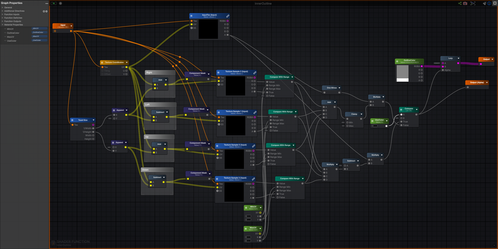

# Shaders

Below are some of the most commonly used shaders alongside their shader graphs:\
\
**AdjacentCircuitPlatesAmplify**

<figure><figcaption></figcaption></figure>

**AFPortalAmplify**

<figure><figcaption></figcaption></figure>

**AquariumFish**

<figure><figcaption></figcaption></figure>

**CircuitPlateAmplify**

<figure><figcaption></figcaption></figure>

**CustomLitAmplify**

<figure><figcaption></figcaption></figure>

**CustomLitColorCyclerAmplify**

<figure><figcaption></figcaption></figure>

**CustomLitColorReplacementAmplify**

<figure><figcaption></figcaption></figure>

**CustomLitGhostAmplify**

<figure><figcaption></figcaption></figure>

**CustomLitMulWithEmissiveAmplify**

<figure><figcaption></figcaption></figure>

**CustomLitRipplingWaterAmplify**

<figure><figcaption></figcaption></figure>

**CustomLitTransparent**

<figure><figcaption></figcaption></figure>

**CustomLitWithEmissiveAmplify**

<figure><figcaption></figcaption></figure>

**ElectricityEmissiveAmplify**

<figure><figcaption></figcaption></figure>

**GroundAmplify**

<figure><figcaption></figcaption></figure>

**WaterAmplify**

<figure><figcaption></figcaption></figure>

**LitAmplify**

<figure><figcaption></figcaption></figure>

**LitFloorEmissiveAmplify**

<figure><figcaption></figcaption></figure>

**InnerOutline**

<figure><figcaption></figcaption></figure>

**LightEmitterAmplify**

<figure><figcaption></figcaption></figure>

**ElectricityOnlyEmissive**

<figure><figcaption></figcaption></figure>

**ElectricityEmissive**

<figure><figcaption></figcaption></figure>

**FloorShadowAmplify**

<figure><figcaption></figcaption></figure>
