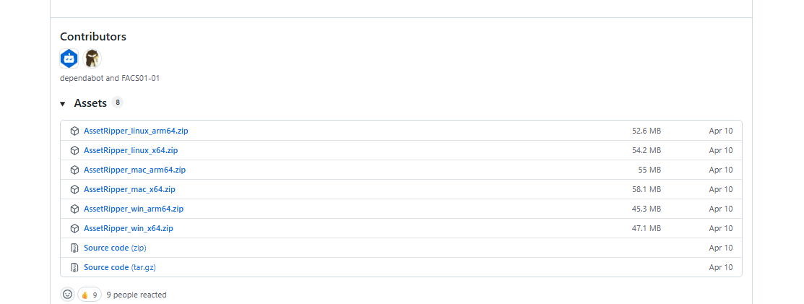

# Updating Game Assets

## Setting up Asset Ripper

In order to set up Asset Ripper you have to first download it here for your corresponding platform - [https://github.com/AssetRipper/AssetRipper/releases/tag/1.2.1](https://github.com/AssetRipper/AssetRipper/releases/tag/1.2.1) . The version must be 1.2.1.&#x20;

<figure><figcaption></figcaption></figure>

## Exporting the Game Assets

this section requires Asset Ripper, if you've not yet set up Asset Ripper then do that first. Once you have Asset Ripper set up open it and select `File` > `Open Folder` .&#x20;

<figure><figcaption></figcaption></figure>

Now you will need to select the path to your Core Keeper Steam install, by default this path will usually be `C:\Program Files (x86)\Steam\steamapps\common\Core Keeper` .&#x20;

Once you've done so, Asset Ripper will scan through the game files. You can see this process in the CMD window that Asset Ripper has opened.&#x20;

When it says `Processing : Finished processing assets` you may proceed to `Export` > `Export All Files` > `Select Folder`, here I recommend creating a new folder which will be easy to find, once you've created a folder select it and continue by pressing `Export Unity Project`. You will now be able to see all of the game files' being processed by Asset Ripper in the CMD window.
