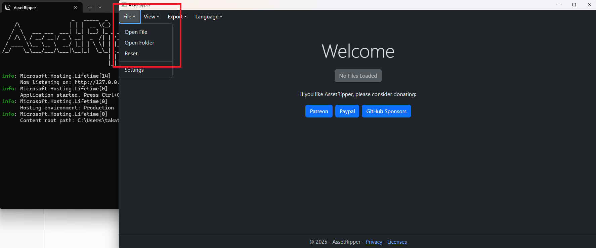
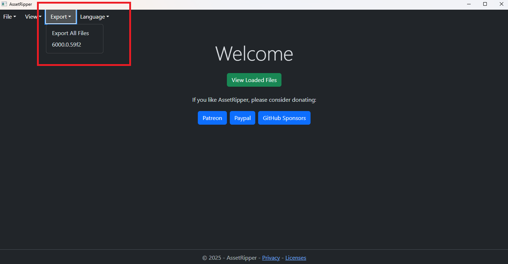

# Updating Game Assets

## Setting up Asset Ripper

In order to set up Asset Ripper you have to first download it here for your corresponding platform - [https://github.com/AssetRipper/AssetRipper/releases/tag/1.2.1](https://github.com/AssetRipper/AssetRipper/releases/tag/1.2.1) . The version must be 1.2.1. You may pick any of the .zip folders that are compatible with your System, for most users this will be `AssetRipper_win_x64.zip` .

<figure><figcaption></figcaption></figure>

## Exporting the Game Assets

this section requires Asset Ripper, if you've not yet set up Asset Ripper then do that first. Once you have Asset Ripper set up open it and select `File` > `Open Folder` .&#x20;

<figure><figcaption></figcaption></figure>

Now you will need to select the path to your Core Keeper Steam install, by default this path will usually be `C:\Program Files (x86)\Steam\steamapps\common\Core Keeper` .&#x20;

Once you've done so, Asset Ripper will scan through the game files. You can see this process in the CMD window that Asset Ripper has opened. Do not close neither the Asset Ripper graphical UI nor the CMD window as if you close one of them you'll need to restart the process.

When Asset Ripper CMD window says `Processing : Finished processing assets` in the last line, you may proceed back to Asset Rippers' Graphical UI **(still, do not close the CMD window)** and move on to `Export` > `Export All Files` . Once there, press `Select Folder` . &#x20;

<figure><figcaption></figcaption></figure>

Here I recommend creating a new folder which will be easy to find, once you've created a folder, you may select it and continue by pressing `Export Unity Project`. You will now be able to see all of the game files' being processed by Asset Ripper in the CMD window. Do not close neither the graphical UI nor the CMD window until the process finishes. Once Asset Ripper CMD window says `Export : Finished post-export` you may close Asset Ripper and return to the ModSDK.&#x20;

<figure><figcaption></figcaption></figure>
